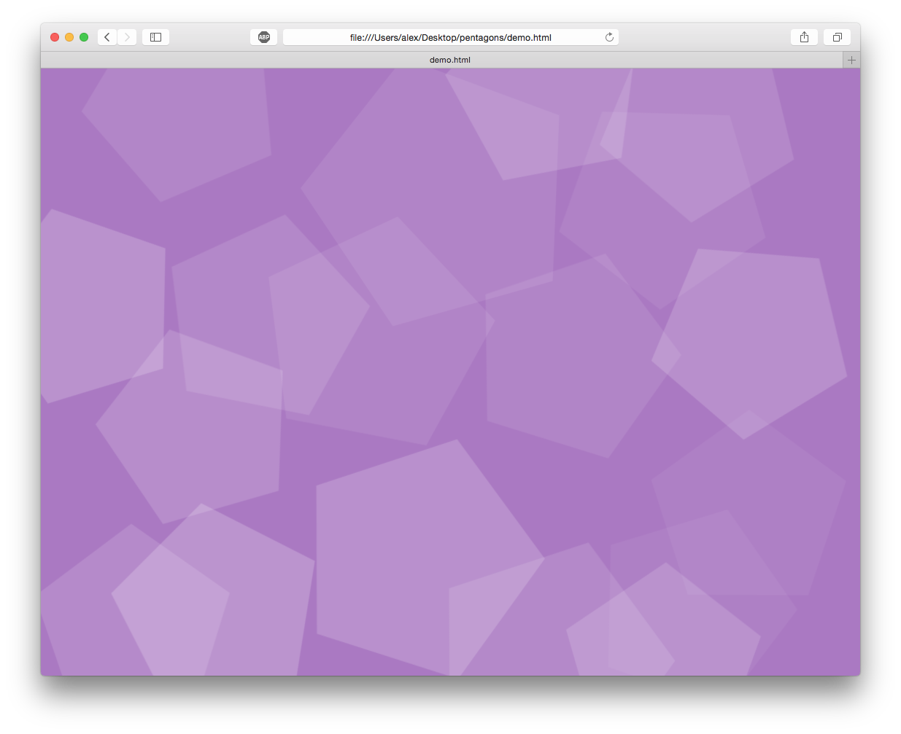

# Overview

**pentagons** gives you a simple way to add a casual sense of freedom to any webpage. Here is a screenshot of what you can expect to see:



# Usage

Simply include the [build/pentagons.js](build/pentagons.js) file in your webpage like this:

```html
<script src="pentagons.js"></script>
```

The **pentagon.js** script will automatically create the pentagon background by adding an element to the beginning of your `<body>` tag. The pentagon background element will have the id "pentagon-background". If your DOM already includes an element with the id "pentagon-background", the pentagons will be added to it and a fresh element will not be generated. This allows you to place the pentagons in the DOM wherever your heart desires.

# Dart version

This used to be a Dart project. You can view the Dart source code on the [old-dart-version](https://github.com/unixpickle/pentagons/tree/old-dart-version) branch.

# License

**pentagons** is under the BSD 2-clause license. See [LICENSE](LICENSE).
